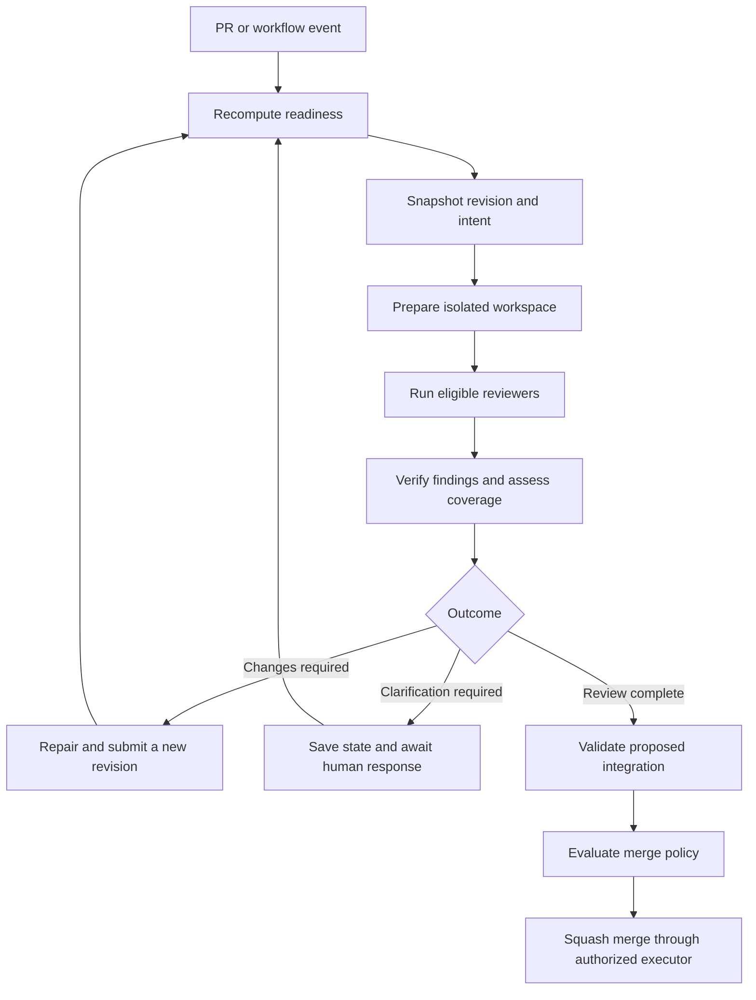

# ferretta
Ferretta (based on a "via ferrata") is a specific-harness for AI models.

## Motivating Mission
Budget Controls, 
Graceful Model Degradation, 
Context consistency,
Local extensibility

## Status
Experimental. The first implementation is a pure Go CLI that parses intent markers and inspects existing GitHub PR conversation comments. The broader execution and review harness below remains a design draft. It is still worth evaluating which parts could be accomplished with a customized pi.dev.

### Try the CLI

Install Go 1.26.5 and Make, then run:

```sh
make build
printf 'PROPOSED-PureGo-v1:: Build with CGO disabled.\n' | bin/ferretta intent parse
bin/ferretta intent inspect --repo owner/repo --pr 123 --humans human-login --agents agent-login
```

`intent parse` reads Markdown from standard input and emits JSON. `intent inspect` reads GitHub's PR conversation comments, checks the proposal/correction/confirmation sequence, and emits a JSON report with the repository, PR, source comment links, authors, and content hashes. Supply `GITHUB_TOKEN` in the environment for private repositories or authenticated API limits. The CLI makes no GitHub writes and does not invoke a model.

Human and agent logins are explicit, disjoint allowlists, matched without regard to case against GitHub-reported authors. A GitHub bot cannot act as a human. Topics are case-sensitive. Markers must start at column one and include a positive version suffix, beginning with `v1`; fenced and quoted examples are ignored. A correction must be followed by a proposal at the next version before confirmation. Choice selections remain in the confirmation body; the CLI does not infer their meaning from prose.

Reports describe the **current comment snapshot**, not a durable historical agreement or authorization to merge. Edited protocol comments produce findings because the original wording cannot be recovered from this API response. Any finding makes `valid` false and returns exit code 1. An exit code of 0 means the observed sequence is valid; it does not mean all topics are confirmed. Deleted comments, changes during pagination, durable evidence storage, and explicit replacement of confirmed decisions still need dedicated handling. Inline code-review comments and PR descriptions are outside this first slice.

### Development

```sh
make install-hooks    # enable the repository's pre-commit checks
make fmt              # format with the pinned toolchain
make check            # same checks as CI
make coverage-update  # retain improved coverage in .coverage-baseline
```

The compiler, `gofmt`, and `go vet` are pinned together through `.go-version` and `go.mod`. Checks run offline tests, enforce an exact statement-coverage ratio, reject lowered baselines, and cross-compile for Linux/macOS on amd64/arm64 with `CGO_ENABLED=0`. The baseline includes the executable entry point. Stage or stash working changes before committing so the local hook checks the commit's contents. CI independently runs `make check` against the base revision's coverage baseline.

Real-provider adapter checks are separate:

```sh
FERRETTA_TEST_REPO=owner/repo FERRETTA_TEST_PR=123 make test-network
```

Choose an existing PR with at least one conversation comment. This read-only suite requires network access and fails when the fixture is not configured. The release policy deciding which minor or major releases require this suite remains deferred.

## Inspiration
pi Coding Agent + openRouter + vLLM

**Keep implementation aligned with human intent, from conversation to merged pull request**

> Design draft. This README describes the proposed product and architecture, not shipped functionality. Commands, APIs, and configuration below are illustrative. Ferretta targets a pure Go implementation and native executables for amd64 and arm64.

Ferretta is an embeddable review and execution harness for agent-assisted software development. It preserves what a human asked for, records the interpretation they agreed to, and checks proposed code against that intent before it lands.

A change can compile, pass tests, and still solve the wrong problem. An agent can invent requirements, introduce unnecessary infrastructure, or turn a small request into an elaborate framework. Ferretta makes those departures reviewable, with findings that connect implementation evidence to the original request.

The PR workflow is the first application of that capability. At its smallest, Ferretta accepts an intent record and a proposed change and returns evidence-backed findings about whether they agree.

## From conversation to agreed intent

Ferretta uses an active-listening workflow:

1. A human describes a goal in chat, writing, or speech.
2. An agent proposes a short interpretation: the desired outcome, constraints, exclusions, and examples.
3. The human confirms, corrects, or clarifies that interpretation.
4. Ferretta records the confirmed version alongside its original evidence.
5. Implementation and review refer to that version. Replacement and amendment semantics are deferred; later confirmations must not silently overwrite earlier agreements.

Confirmation belongs in the conversation the human is already having. A host application can capture “yes, that sounds right” against the specific interpretation it presented. Ferretta does not require a separate specification-writing ceremony or a terminal prompt.

Consequential ambiguity remains visible until resolved. Agent assumptions never silently become human requirements.

### GitHub conversation vocabulary

GitHub comments are the initial proposed surface for interpretation and confirmation. Markers use `{VOCAB}-{TopicName-or-ID}::`, with an explicit version identifying the proposal, for example `PROPOSED-PureGo-v1::`. The marker always ends with a double colon; ordinary prose follows it.

- **PROPOSED** (agent authored): an interpretation, clarification, or application of a principle. It may offer fully specified choices such as A–D.
- **CORRECTED** (human authored): the proposal does not adequately represent the human's intent, or none of its options fits comfortably. The agent must reconsider the framing and issue a revised PROPOSED version. Unmentioned portions are not implicitly accepted.
- **CONFIRMED** (human authored): accepts the exact proposal version, or an explicitly selected option within it. Only confirmation establishes agreed intent.

The loop is `PROPOSED v1 → CORRECTED v1 → PROPOSED v2 → CONFIRMED v2`; a proposal can also be confirmed immediately. Versions advance when the interpretation changes, not when it is discussed or confirmed. Preserve the exact confirmed wording and verify authorship from the authenticated actor, not the marker alone.

Repository identity, PR number, and `CONFIRMED-Topic-vX::` identify a decision, with a direct comment link as supporting evidence. `AMENDED` is not part of the initial vocabulary.

### The intent record

An intent record keeps three layers distinct:

| Layer | Contents | Role |
| --- | --- | --- |
| Original evidence | Messages, transcript passages, audio references, timestamps, and source hashes | Preserves what was actually said; a transcript is a derived representation of its audio source |
| Confirmed intent | Outcome, constraints, exclusions, examples, source references, and confirmation | Defines the agreed task for a particular version |
| Agent interpretation | Assumptions, proposed design choices, unresolved questions | Provides context without acquiring the authority of confirmed intent |

Confirmation records identify the confirming person, the interpretation version, and the associated response. Evidence is retained according to the host's storage and privacy policy; Ferretta need not copy recordings into Git or send them to every model.

For example:

> “Run this on my machine as one binary. I don't want a service to administer.”

A PR that requires a separately administered database server should receive an intent finding even if every test passes. The finding should cite the statement, identify the new dependency, and explain the mismatch.

## Two review questions

Ferretta reviews both:

- **Correctness:** Does the change work? What failures, regressions, or missing tests does the evidence reveal?
- **Intent alignment:** Does the change deliver the agreed outcome and respect its constraints? Did it omit a requirement, add unjustified scope, or introduce complexity the task does not call for?

Intent review does not prohibit implementation judgment. Reviewers must explain why a choice conflicts with the agreed task; unfamiliar code or personal style preferences are insufficient grounds for blocking a change.

Each finding records the reviewed revision, relevant intent clause, code location, failure or mismatch scenario, supporting evidence, and verification status. Outcomes distinguish complete review, confirmed findings, incomplete coverage, and execution failure. A failed review is not a clean review.

## A PR lifecycle



The harness records repository identity, PR number, head and base repositories, branch names, head and base commit SHAs, merge base, intent version, and policy version. Workspaces are prepared at exact commits. Branch names are navigation aids, not proof of what was reviewed.

Fixes create a new revision and require renewed review. Results from older revisions remain available as history but cannot silently authorize the new change.

### Ready for review

Readiness is a configurable condition, recomputed from current state whenever a relevant event arrives.

The proposed default requires:

- An open, non-draft PR.
- A confirmed intent version associated with the PR.
- An explicit author handoff, which can be the transition out of draft or opening the PR as ready.

Intent review can begin while CI runs. An optional policy can wait for inexpensive checks such as build, lint, and type checking before spending model compute. A readiness label is optional, not an additional mandatory ceremony.

### Ready to merge

Merge eligibility additionally requires:

- Completed reviews satisfying the configured independence policy.
- No unresolved blocking findings or required coverage gaps.

## Development principles

- **Pure Go:** favor dependencies that do not require CGO. Target native amd64 and arm64 builds, verified with `CGO_ENABLED=0`.
- **Fast tests:** keep the normal test suite fast and deterministic. The normal suite must not depend on live network calls or unnecessary wall-clock waits; networked release tests run separately.
- **Reasonable coverage:** cover as much code as is reasonable, emphasizing meaningful behavior, failure paths, and business rules. Maximizing coverage at any cost is not the goal.
- **Dependency injection:** inject client dependencies at library boundaries so tests can supply fake clients or configure clients to use controlled test transports.
- **Pure core; effects at the edge:** the core composes command objects; a thin executor performs their effects and returns results. Keep network, filesystem, process, and timing effects out of the core.
- **The core owns policy; the executor owns mechanics:** the core decides whether an action or retry is justified and affordable. The executor performs the requested operations, including waits and requests, and reports their outcomes without taking over business rules.
- **Make nondeterminism an explicit input:** supply time, randomness, IDs, and model responses through explicit inputs at the boundary. The same core state and inputs must produce the same decisions.
- **Test observable behavior and invariants:** assert outcomes and rules such as human-only intent confirmation, revision-specific review authorization, and budget enforcement. Avoid tests that merely mirror implementation details or private call sequences.
- **Verify the adapters as well as the core:** maintain a separate networked test suite that checks adapters against real providers before releases covered by release policy. Whether that policy covers all minor releases or only major releases remains undecided. Keep the normal suite independent of live services.
- **Unless it's painfully obvious, assume the provider does not handle idempotency:** require clear evidence of a provider's idempotency guarantees before relying on them. A timeout does not prove an effect failed to occur; reconcile uncertain outcomes before repeating effects, and surface uncertainty when reconciliation is unavailable.
- **Controlled failure scenarios:** use fake clients and controlled executors to exercise network failures, latency, cancellation, retries, and timeouts. Prefer injected clocks or controllable waits for business-rule tests; keep any necessary real sleeps short and confined to executor tests.
- **Coverage ratchet:** commits must fail checks when coverage falls below the accepted baseline. Use consistent measurement settings and retain gains in the baseline; do not lower it to make a change pass.
- **Local/CI parity:** local development and CI must use the same pinned compiler, formatter, linter, configuration, and check entry points.

These requirements guide the implementation. The first CLI includes offline tests, a separate networked adapter suite, coverage enforcement, a local commit hook, and the shared CI check entry point described above.
