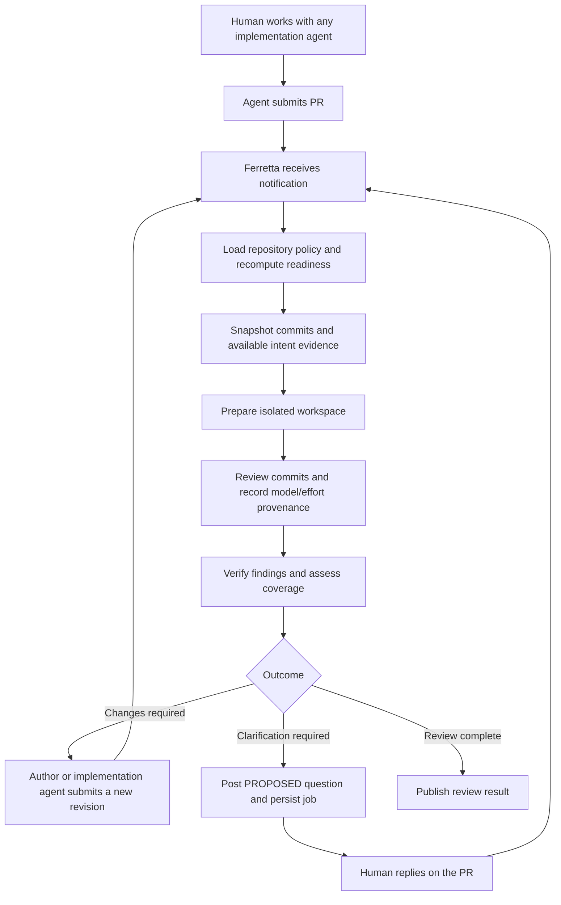

# Ferretta


**A local-first PR review harness for correctness, human intent, and implementation tradeoffs.**

Work with any coding agent, using any workflow. Once that agent submits a pull
request, Ferretta reviews the proposed commits against trusted repository policy.
It looks for bugs, consequential ambiguity, and unnecessary complexity. An earned
LGTM is a valid result; the reviewer should not manufacture work.

The [inspiration catalogue](inspiration.md) records Go harnesses, design ideas,
and tradeoffs worth revisiting.

The name comes from *via ferrata*: a supported route through difficult terrain.
The aim is useful progress toward the human's intended software, with explicit
resource limits and evidence that remains tied to the code actually reviewed.

## What works today

Ferretta is experimental, written in pure Go, and builds for macOS/Linux on
amd64/arm64 with CGO disabled.

| Capability | Current behavior |
| --- | --- |
| Local PR review | A bounded Ollama tool loop reads exact commits, executes trusted checks in a detached worktree, and produces an advisory report. |
| Review provenance | Records head/base commits, policy hash, requested model/thinking settings, and provider-reported details when available. |
| GitHub identity | Uses a dedicated GitHub App installation. Fetch tokens are read-only; proposal posting uses separate repository-scoped comment-write tokens. |
| Setup | `init` discovers local model metadata and creates an Ollama policy; `doctor` checks readiness. Downloads and inference are explicit, separate actions. |
| Intent inspection | Parses and inspects existing proposal/correction/confirmation comments. Proposal sessions retain authenticated human correction/confirmation evidence. |
| Background service | Intake-only polling, or explicit `service watch` for a selected PR or allowlisted repository PRs with review/evaluation Checks, checkpoint progress, and intent-question comments. |
| Automated scorecard | A separate read-only judge grades worker output and the oversight decision; records evidence and model/tool usage. |
| Check retries | Explicit CLI retries or signed GitHub Check re-run webhooks create durable attempts while retaining history and cumulative compute allowances. Evaluation-only retries preserve the review. |

Reviews can produce findings, an intent question, an advisory LGTM, or an
incomplete result when checks, context, or resource limits prevent completion.
Reports and private session checkpoints are saved locally. Opt-in [proposal
sessions](docs/proposals.md) post questions through the GitHub App and resume
through explicit polling or a scoped watcher after human replies. Ferretta does not yet push repairs
or merge PRs.

The next stages are policy-selected model waves and fallbacks, fuller resource accounting,
OpenRouter inference, and gated repairs/merging. The agreed configuration layers
and cost/time/quality objectives are described in [configuration decisions](docs/configuration.md)
and [architecture](arch.md); the layered TOML resolver is not implemented.

The [review and scorecard guide](docs/evaluation.md) explains the implemented
Checks workflow, legacy comment mode, and their limits. The [implementation plan](docs/review-evaluation.md)
records the broader effort. Automated grades are assessments, not verified correctness.

### Self-review checkpoint

On September 29, 2026, Ferretta reviewed [PR #1](https://github.com/ericdmoore/ferretta/pull/1)
at commit [08815c3](https://github.com/ericdmoore/ferretta/commit/08815c3e86ab596e09daf0b9b68a6411579f1eac)
using local `gpt-oss:20b` with requested medium effort. The default 64K context
admission check stopped the first attempt before inference; a separate policy
with 128K context admitted the PR, retaining the ten-turn and ten-minute limits.

The admitted run returned **incomplete** after ten turns: nine `run_checks` calls
contained an unsupported `cmd` argument and were rejected. The tenth call was
valid and the configured `make check` passed, but the model had no remaining turn
to submit a verdict. This run establishes authenticated fetch, isolated check
execution, and bounded termination; it supplies no LGTM. Improving invalid-tool-call
recovery and detecting repeated lack of progress are the next review-loop work.

Follow-up attempts raised the allowance to 100 model turns with the same model,
medium effort, 128K context, and ten-minute timeout. They remained **incomplete**:
one received HTTP 500 from Ollama, another exhausted the 4,096-token output
allowance in a single response, and a retry with 16,384 output tokens stopped at
the conservative context admission bound after three replies. None reached the
100-turn ceiling or produced a verdict. New setup policies now allow 100 turns;
`init --max-turns N` accepts 1–200. More turns do not remove independent output,
context, and time limits; conversation compaction remains future work. Proposal-only resumption was added
subsequently; general interrupted-model replay remains unsupported.

On September 30, the paged tools and provider-measured context prefix allowed a
local review to complete 19 model replies, pass the configured checks, and call
`request_intent_confirmation`. Its last reported prompt was about 31K tokens.
The result was a **local draft question**, not LGTM or a posted comment. Its
wording referred to a missing “change above”; the prompt now explicitly requires
self-contained intent questions and directs concrete bugs to findings. This
validates tool execution, not the quality of every model-generated proposal.

A later [live comparison](docs/review-experiments.md) exposed the reviewer asking
the human to choose its verdict. Clearer finalization guidance yielded an advisory
LGTM on retry, but evidence coverage, tradeoff explanations, and search ergonomics
still need work. Successful completion alone does not establish review quality.

### Website and installation

The Hugo site targets **[ferretta.cc](https://ferretta.cc/)** and serves the root
`install.sh` for macOS/Linux on amd64/arm64. It installs checksum-verified GitHub
release binaries and offers optional component setup. Public installation needs
the site deployed over HTTPS and a published release; draft releases do not qualify.
See [site development and launch](docs/site.md) for preview, Pages/DNS setup, and
release prerequisites.

### Get a first useful review

With Go 1.26.5 and Make installed, start with a labeled example that needs no
credentials or model:

```sh
make build
bin/ferretta demo
```

Then use `init`, `auth github --setup`, and `doctor` to prepare a small, trusted PR. The
[getting-started guide](docs/getting-started.md) covers a local Qwen 4B path,
an explicit two-turn model test, and your first advisory review. Setup performs
metadata discovery only; model downloads and inference are separate actions.

### Background service

```sh
bin/ferretta service run --repo ericdmoore/ferretta --state /absolute/private/state
bin/ferretta service status --state /absolute/private/state
```

The service polls through the configured GitHub App and remembers exact PR
revisions across restarts. `service run` is intake-only: no inference, PR code
execution or GitHub writes. Use the explicit [scoped watcher](docs/evaluation.md)
to enable automatic reviews and scorecards for one PR, or use
`--all-prs --authors LOGIN` to pick up new ready PRs from trusted authors on branches
in the watched repository. [Boot service templates and operation](docs/service.md)
cover macOS LaunchDaemon and Linux systemd deployment.

The agreed configuration hierarchy and `cost`/`time`/`quality` presets are recorded
in [configuration decisions](docs/configuration.md). The layered TOML resolver and
objective selector are not implemented yet. [Architecture](arch.md) records the
service lifecycle, credential boundary and planned execution/recovery rules.

### Try the CLI

Install Go 1.26.5 and Make, then run:

```sh
make build
printf 'PROPOSED-PureGo-v1:: Build with CGO disabled.\n' | bin/ferretta intent parse
bin/ferretta intent inspect --repo owner/repo --pr 123 --humans human-login --agents agent-login
```

`intent parse` reads Markdown from standard input and emits JSON. `intent inspect` reads GitHub's PR conversation comments, checks the proposal/correction/confirmation sequence, and emits a JSON report with the repository, PR, source comment links, authors, and content hashes. Configure the dedicated [GitHub App connection](docs/github-app-auth.md) for API access; personal tokens and the `gh` login are not used by the CLI. The intent commands do not invoke a model or write to GitHub. Proposal sessions and the scoped watcher can publish through the App.

Human and agent logins are explicit, disjoint allowlists, matched without regard to case against GitHub-reported authors. A GitHub bot cannot act as a human. Topics are case-sensitive. Markers must start at column one and include a positive version suffix, beginning with `v1`; fenced and quoted examples are ignored. A correction must be followed by a proposal at the next version before confirmation. Choice selections remain in the confirmation body; the CLI does not infer their meaning from prose.

Reports describe the **current comment snapshot**, not a durable historical agreement or authorization to merge. Edited protocol comments produce findings because the original wording cannot be recovered from this API response. Any finding makes `valid` false and returns exit code 1. An exit code of 0 means the observed sequence is valid; it does not mean all topics are confirmed. Deleted comments, changes during pagination, durable evidence storage, and explicit replacement of confirmed decisions still need dedicated handling. Inline code-review comments and PR descriptions are outside this first slice.

### GitHub authentication

Ferretta uses its own GitHub App installation identity for PR metadata, comments,
and Git fetches. Configure its client ID, installation ID, and private-key file
in machine-level `ferretta/github.json`, outside this repository. See the
[registration and configuration guide](docs/github-app-auth.md).

```sh
bin/ferretta auth github --repo ericdmoore/ferretta
```

This verifies access and prints the bot identity without inference or PR writes.
There is no personal-login fallback, and configuring authentication does not start
a watcher. Checks still execute as the local OS user; the worktree and environment
filter are not a security sandbox.

### Review a PR with a local model

The initial review adapter uses Ollama on a loopback endpoint. It requires installed Git, a configured [GitHub App installation](docs/github-app-auth.md), and a local model advertising tool-use and thinking support. The checked-in `.ferretta/review.json` selects the installed `gpt-oss:20b` model at medium effort with explicit turn/token/time limits. Change that trusted policy to match your machine; this command does not download a model or fall back to hosted inference.

```sh
make build
bin/ferretta review --repo ericdmoore/ferretta --pr 1
```

Use the actual open, non-draft PR number. Run from a checkout whose `origin` matches that repository. The command fetches exact head/base commits, creates a temporary detached worktree, and gives the model tools to read files, list files, run the policy's checks, and submit a verdict. The first adapter executes the configured checks directly in that worktree, so use a policy and PR code you trust to execute locally; the worktree is isolation from your checkout, not an operating-system sandbox.

The [review tool registry](docs/review-tools.md) also provides bounded literal or
regex search against the exact commit. Invalid calls receive structured recovery
guidance with available tools, input schemas, and valid suggestions.

Exit code 0 means an advisory LGTM whose configured checks passed; code 2 means changes, clarification, or incomplete review; code 1 means a setup/output failure. The PR head and base are checked again before returning. Private session checkpoints and a report are written under `.ferretta/runs/` (ignored by Git). Terminal output defaults to readable text; use `--format json` for scripts. The public report retains requested model/effort and observed model/token usage; effective effort stays unknown unless reported by the provider. Session checkpoints preserve model continuation data and are not uploaded.

Ordinary review invocations start new attempts. `--publish-proposals --humans YOUR_LOGIN` enables durable proposal posting, and `--resume PATH` polls for human replies and continues the saved conversation. Reviews use PR metadata, a diff summary, and paged diff/source tools. Automatic notifications and general interrupted-model replay remain future work. See [proposal sessions](docs/proposals.md).

### Development

```sh
make                  # show commands and examples (same as make help)
make install-hooks    # enable the repository's pre-commit checks
make test             # run fresh offline tests
make coverage         # full-suite coverage, including a per-function summary
make coverage-html    # generate bin/coverage.html for browsing
make build            # native executable at bin/ferretta
make build-all        # Linux/macOS executables for amd64 and arm64
make package VERSION=v0.1.0  # four tar.gz archives and SHA-256 checksums in dist/
make run              # build and run the CLI (defaults to --help)
make fmt              # format with the pinned toolchain
make lint             # run go vet with the pinned toolchain
make check            # same complete checks as CI
make coverage-update  # retain improved coverage in .coverage-baseline
```

For focused work, use `make test PKG=./internal/intent TEST=TestParse`; `TEST` is a Go test-name regular expression. Run CLI commands with `make run ARGS="intent parse" < comment.md`. Coverage commands always exercise the full offline suite, independent of `PKG` and `TEST`. They generate reports without modifying the coverage baseline; `make check` enforces the ratchet and `make coverage-update` records gains. Build outputs and the HTML report live in the ignored `bin/` directory.

The compiler, `gofmt`, and `go vet` are pinned together through `.go-version` and `go.mod`. Checks run offline tests, enforce an exact statement-coverage ratio, reject lowered baselines, and cross-compile for Linux/macOS on amd64/arm64 with `CGO_ENABLED=0`. The baseline includes the executable entry point. Stage or stash working changes before committing so the local hook checks the commit's contents. CI independently runs `make check` against the base revision's coverage baseline.

Real-provider adapter checks are separate:

```sh
FERRETTA_TEST_REPO=owner/repo FERRETTA_TEST_PR=123 make test-network
```

Choose an existing PR with at least one conversation comment. This read-only suite requires network access and fails when the fixture is not configured. The release policy deciding which minor or major releases require this suite remains deferred.

### CI and release binaries

`.github/workflows/check.yml` runs the shared checks on PRs and pushes to `main`, then uploads the four platform binaries as downloadable Actions artifacts. `.github/workflows/release.yml` runs on pushed version tags such as `v0.1.0`, checks the tagged revision, packages the binaries with README/license files and SHA-256 checksums, and uploads them to a **draft GitHub release**.

Drafts stage the assets for review before publication. Run the applicable networked release checks before publishing; the minor/major release-test cadence remains undecided. Re-running the workflow may replace draft assets but refuses to alter a published release. No release tag is created by `make package`, and packaging alone does not upload files.

## Inspiration
pi Coding Agent + openRouter + vLLM

**Review submitted pull requests for correctness and alignment with human intent**

> Design draft. This README describes the proposed product and architecture, not shipped functionality. Commands, APIs, and configuration below are illustrative. Ferretta targets a pure Go implementation and native executables for amd64 and arm64.

The [configuration specification](docs/configuration.md) includes a proposed challenger amendment for budgeted, repository-specific model exploration and evaluation.

Ferretta is a PR review harness for agent-assisted software development. A human works with any coding agent, through any workflow, and that agent produces software and submits a PR. Only then does Ferretta enter the process: it receives a notification, prepares the review environment, and reviews the proposed commits according to policy configured for the repository.

Ferretta does not need to participate in the original conversation or control the implementation agent. It uses the evidence available with the PR and asks the human for clarification in PR comments when an interpretation matters to the review. The intent record grows from those review-time exchanges; a pre-existing confirmed intent record is not a prerequisite for starting review.

A change can compile, pass tests, and still solve the wrong problem. An agent can invent requirements, introduce unnecessary infrastructure, or turn a small request into an elaborate framework. Ferretta makes those departures reviewable, with findings that connect implementation evidence to the original request.

Each review retains its model and effort provenance, along with the exact commits and policy it used. Findings and clarification questions remain traceable to that review attempt.

## From submitted PR to clarified intent

The intended workflow is:

1. A human and an implementation agent work together outside Ferretta, using any tools or interaction style.
2. The agent submits a PR. A notification brings the PR to Ferretta.
3. Ferretta loads the repository's review policy, identifies the exact commits to review, and prepares an environment as needed: clone or fetch the repository, prepare the workspace, and perform the configured setup.
4. Ferretta reviews the commits, recording the model, effort level, policy, and revision associated with each attempt.
5. When clarification is needed, the reviewing agent posts a versioned PROPOSED marker and its question or interpretation on the PR. It may offer multiple-choice options.
6. The human responds on the PR with a correction or confirmation referencing that topic and version. The response notifies Ferretta and resumes the saved review job.
7. A correction causes a revised proposal at the next version. A confirmation adds the agreed interpretation to the intent record and lets the affected review work continue.

The original implementation agent and Ferretta's reviewing agent have distinct roles. In this workflow, the PROPOSED author is Ferretta's reviewer. The human need not adopt a new coding workflow or provide a complete specification before a PR can be reviewed.

Consequential ambiguity remains visible until resolved. Agent assumptions never silently become human requirements. Replacement and amendment semantics remain deferred; later confirmations must not silently overwrite earlier agreements.

### GitHub conversation vocabulary

GitHub PR comments are the surface for review-time interpretation and confirmation. Markers use `{VOCAB}-{TopicName-or-ID}::`, with an explicit version identifying the proposal, for example `PROPOSED-PureGo-v1::`. The marker always ends with a double colon; ordinary prose follows it.

- **PROPOSED** (agent authored): an interpretation, clarification, or application of a principle. It may offer fully specified choices such as A–D.
- **CORRECTED** (human authored): the proposal does not adequately represent the human's intent, or none of its options fits comfortably. The agent must reconsider the framing and issue a revised PROPOSED version. Unmentioned portions are not implicitly accepted.
- **CONFIRMED** (human authored): accepts the exact proposal version, or an explicitly selected option within it. Only confirmation establishes agreed intent.

The loop is `PROPOSED v1 → CORRECTED v1 → PROPOSED v2 → CONFIRMED v2`; a proposal can also be confirmed immediately. Versions advance when the interpretation changes, not when it is discussed or confirmed. Preserve the exact confirmed wording and verify authorship from the authenticated actor, not the marker alone.

Repository identity, PR number, and `CONFIRMED-Topic-vX::` identify a decision, with a direct comment link as supporting evidence. `AMENDED` is not part of the initial vocabulary.

### The intent record

An intent record keeps three layers distinct. Original conversation material is optional supporting evidence when supplied; Ferretta does not require access to the human's earlier interaction with the coding agent.

| Layer | Contents | Role |
| --- | --- | --- |
| Original evidence | Messages, transcript passages, audio references, timestamps, and source hashes | Preserves what was actually said; a transcript is a derived representation of its audio source |
| Confirmed intent | Outcome, constraints, exclusions, examples, source references, and confirmation | Defines the agreed task for a particular version |
| Agent interpretation | Assumptions, proposed design choices, unresolved questions | Provides context without acquiring the authority of confirmed intent |

Confirmation records identify the confirming person, the interpretation version, and the associated response. Evidence is retained according to the host's storage and privacy policy; Ferretta need not copy recordings into Git or send them to every model.

For example:

> “Run this on my machine as one binary. I don't want a service to administer.”

A PR that requires a separately administered database server should receive an intent finding even if every test passes. The finding should cite the statement, identify the new dependency, and explain the mismatch.

## Two review questions

Ferretta reviews both:

- **Correctness:** Does the change work? What failures, regressions, or missing tests does the evidence reveal?
- **Intent alignment:** Does the change deliver the agreed outcome and respect its constraints? Did it omit a requirement, add unjustified scope, or introduce complexity the task does not call for?

Intent review does not prohibit implementation judgment. Reviewers must explain why a choice conflicts with the agreed task; unfamiliar code or personal style preferences are insufficient grounds for blocking a change.

Each finding records the reviewed revision, relevant intent clause, code location, failure or mismatch scenario, supporting evidence, and verification status. Outcomes distinguish complete review, confirmed findings, incomplete coverage, and execution failure. A failed review is not a clean review.

### What LGTM means

LGTM is a legitimate review outcome. The reviewer should approve when the evidence supports that the implementation accomplishes the human's intent, satisfies repository policy, and is a small, coherent, well-designed solution. Reviewers must not manufacture findings or propose extra abstractions simply to demonstrate activity.

Simplicity includes the concepts, dependencies, configuration, and operational work the implementation introduces, as well as its code size. Removing necessary behavior, tests, or readable structure to reduce line count does not satisfy this goal. An objection to complexity should identify a concrete cost and a simpler viable alternative within the agreed constraints.

An LGTM result includes a concise account of:

- The intent and exact revision reviewed, with the evidence supporting alignment.
- The important checks performed and their outcomes.
- Why the implementation is appropriately small and well-designed for this task.
- Major implementation tradeoffs, including what the chosen simplicity gives up and why that is acceptable for the stated intent. If no material tradeoff needs discussion, say so rather than inventing one.
- Any remaining non-blocking limitations, together with the review's scope and model/effort provenance.

The model proposes a verdict; the core decides whether it can be accepted under policy. The text `LGTM` alone cannot override an unresolved blocking finding, consequential unanswered clarification, incomplete required checks, or a stale revision. A budget limit or exhausted turn allowance produces an incomplete review when required work remains. Approval is an evidence-backed judgment within the reviewed scope, not a claim of provable perfection or global minimality.

### Repository policy and review provenance

Review behavior is configured with the repository. The policy defines the review scope and checks, model selection and effort settings, resource limits, and when human clarification must pause affected work. Its file format and configuration location remain to be designed.

The policy must describe both where inference runs and the capabilities the review requires:

| Policy concern | Required meaning |
| --- | --- |
| Model source | Select a model running on local hardware or a model accessed through OpenRouter, with its model identifier and endpoint/provider configuration. |
| Tool use | Specify the tools the reviewer may request, such as reading files, inspecting diffs/history, running configured checks, and requesting human clarification. Executors validate and perform authorized calls and return their results. |
| Multi-turn review | Support repeated model calls and tool results within one review session, including continuation after a human response. Configure turn, token, time, and cost limits. |
| Thinking/reasoning | Specify the required reasoning capability and desired effort or reasoning budget using the controls supported by the selected model. Unsupported required settings make that route ineligible. |
| Fallbacks | Explicitly configure permitted alternative models or routes. A local-only policy must not silently send work to a hosted model; a fallback must still satisfy required tool and reasoning capabilities. |
| Completion | Define the evidence and checks required to accept a verdict, and which unresolved questions prevent completion. |

Ferretta remains a pure Go harness; a local inference adapter can communicate with a model runtime on the machine. Local execution and OpenRouter should support the same review lifecycle without pretending every model has identical capabilities or reasoning controls.

The review loop is: supply the current task and evidence, request a model turn, validate any requested tool calls, execute permitted commands, return their results, and continue until a verdict, clarification, or policy limit is reached. Tool execution belongs to the harness. A request to ask the human produces a persisted question and a paused review step, followed by continuation when the reply arrives.

Persist the conversation, tool results, and provider-required continuation data so later turns retain their context. Preserve any opaque reasoning continuation blocks needed by the provider without interpreting them as public review evidence. The PR-facing explanation should summarize the decision and supporting evidence. OpenRouter documents [tool-calling conversations](https://openrouter.ai/docs/guides/features/tool-calling) and [reasoning controls and continuation](https://openrouter.ai/docs/guides/best-practices/reasoning-tokens); adapters must honor the selected model's supported behavior.

Each model attempt must retain:

- A review job ID and attempt ID, repository and PR identity, and exact head/base commit SHAs.
- The policy version or content hash and the intent evidence available to that attempt, including an empty initial intent record when appropriate.
- The provider, requested model identifier or type, and requested effort level.
- The actual model and effective effort when the provider reports them; otherwise these remain explicitly unknown rather than inferred from the request.
- Turn and tool-call identifiers, request/response identifiers available from the provider, timing, usage/cost information when available, and the outcome, including failure or incomplete work.

Every finding and PROPOSED comment links back to its originating attempt. A fallback model, changed effort level, or retry creates a separately attributable attempt rather than overwriting the earlier provenance.

### Notifications and continuation

PR submission starts a review job. Relevant later events, including new commits and human clarification replies, wake that same job. The CLI needs a listening mode or an external invoker delivering events; the current one-shot inspection command does not receive notifications.

Notification delivery is an adapter concern. The first local service uses polling for open PR revisions; comment polling and optional webhook/relay adapters remain future work. The core decides whether a delivered event advances a job. Duplicate notifications must not repeat model spending or post duplicate clarification comments. A reply is correlated using the repository, PR, topic, and proposal version, then checked against the configured human identities.

While awaiting a human answer, persist the job, pending question, and review provenance so execution can resume after a restart. Recheck the PR revision on resumption; evidence from an older revision does not authorize newly pushed code.

## A PR lifecycle



The harness records repository identity, PR number, head and base repositories, branch names, head and base commit SHAs, merge base, intent version, and policy version. Workspaces are prepared at exact commits. Branch names are navigation aids, not proof of what was reviewed.

Fixes create a new revision and require renewed review. Results from older revisions remain available as history but cannot silently authorize the new change.

### Ready for review

Readiness is a configurable condition, recomputed from current state whenever a relevant event arrives.

The proposed default requires:

- An open, non-draft PR.
- An explicit author handoff, which can be the transition out of draft or opening the PR as ready.

Confirmed intent is not an admission requirement. Review begins from the submitted PR and repository policy; missing or ambiguous intent is clarified during review. A consequential unanswered question may block the affected conclusion without preventing unrelated review work.

Intent review can begin while CI runs. An optional policy can wait for inexpensive checks such as build, lint, and type checking before spending model compute. A readiness label is optional, not an additional mandatory ceremony.

### Later integration and merge handling

The initial workflow produces a review result. Automated repair, integration validation, and merging are possible later extensions, not prerequisites for this review service. If merge execution is added, eligibility additionally requires:

- Completed reviews satisfying the configured independence policy.
- No unresolved blocking findings or required coverage gaps.

## Development principles

- **Pure Go:** favor dependencies that do not require CGO. Target native amd64 and arm64 builds, verified with `CGO_ENABLED=0`.
- **Make impossible states impossible:** model application state with types and structures that express the valid states and transitions while preventing bad or inconsistent combinations. Give each state the data it requires; avoid independent flags and optional fields that permit contradictions. In Go, use distinct types, encapsulated fields, and constructors or transition functions that preserve invariants. Validate external data at the boundary and handle zero values explicitly where the type system cannot enforce a constraint. For example, a confirmed intent must carry its exact proposal and human confirmation evidence, and a review awaiting clarification must carry its pending question.
- **Fast tests:** keep the normal test suite fast and deterministic. The normal suite must not depend on live network calls or unnecessary wall-clock waits; networked release tests run separately.
- **Reasonable coverage:** cover as much code as is reasonable, emphasizing meaningful behavior, failure paths, and business rules. Maximizing coverage at any cost is not the goal.
- **Dependency injection:** inject client dependencies at library boundaries so tests can supply fake clients or configure clients to use controlled test transports.
- **Pure core; effects at the edge:** the core composes command objects; a thin executor performs their effects and returns results. Keep network, filesystem, process, and timing effects out of the core.
- **The core owns policy; the executor owns mechanics:** the core decides whether an action or retry is justified and affordable. The executor performs the requested operations, including waits and requests, and reports their outcomes without taking over business rules.
- **Make nondeterminism an explicit input:** supply time, randomness, IDs, and model responses through explicit inputs at the boundary. The same core state and inputs must produce the same decisions.
- **Test observable behavior and invariants:** assert outcomes and rules such as human-only intent confirmation, revision-specific review authorization, and budget enforcement. Avoid tests that merely mirror implementation details or private call sequences.
- **Verify the adapters as well as the core:** maintain a separate networked test suite that checks adapters against real providers before releases covered by release policy. Whether that policy covers all minor releases or only major releases remains undecided. Keep the normal suite independent of live services.
- **Unless it's painfully obvious, assume the provider does not handle idempotency:** require clear evidence of a provider's idempotency guarantees before relying on them. A timeout does not prove an effect failed to occur; reconcile uncertain outcomes before repeating effects, and surface uncertainty when reconciliation is unavailable.
- **Controlled failure scenarios:** use fake clients and controlled executors to exercise network failures, latency, cancellation, retries, and timeouts. Prefer injected clocks or controllable waits for business-rule tests; keep any necessary real sleeps short and confined to executor tests.
- **Coverage ratchet:** commits must fail checks when coverage falls below the accepted baseline. Use consistent measurement settings and retain gains in the baseline; do not lower it to make a change pass.
- **Local/CI parity:** local development and CI must use the same pinned compiler, formatter, linter, configuration, and check entry points.

These requirements guide the implementation. The first CLI includes offline tests, a separate networked adapter suite, coverage enforcement, a local commit hook, and the shared CI check entry point described above.
