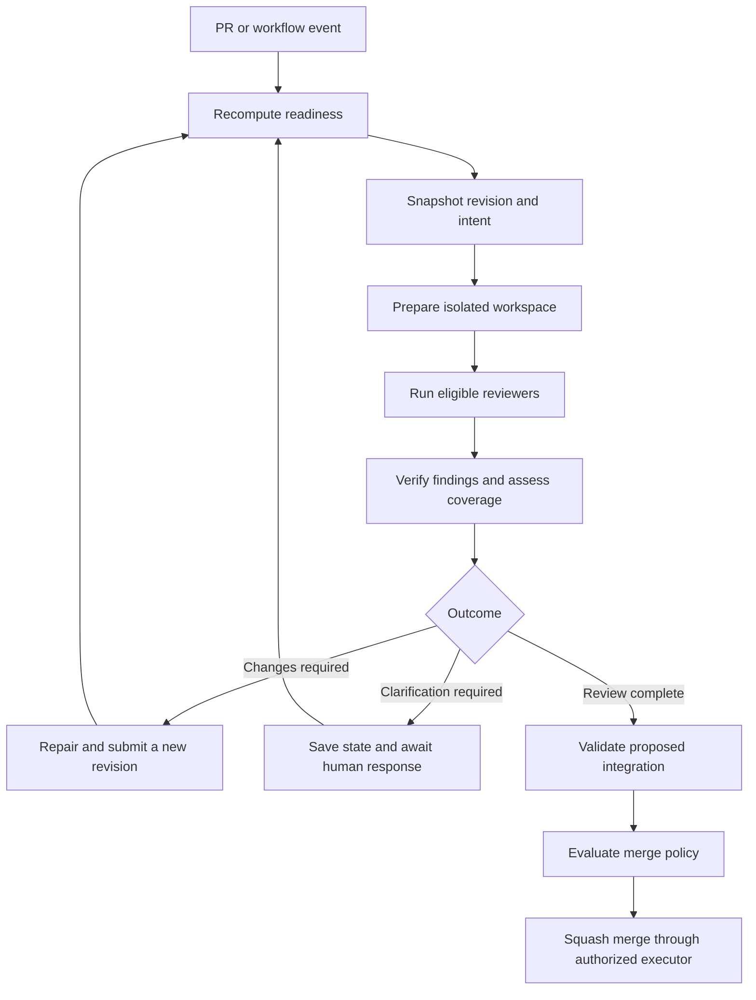

# ferretta
Ferretta (based on a "via ferrata") is a specific-harness for AI models.

## Motivating Mission
Budget Controls, 
Graceful Model Degradation, 
Context consistency,
Local extensibility

## Status
Experimental - possible its 
accomplished w/ highly customized pi.dev

## Inspirstion 
pi Coding Agent + openRouter + vLLM

**Keep implementation aligned with human intent, from conversation to merged pull request**

> Design draft. This README describes the proposed product and architecture, not shipped functionality. Commands, APIs, and configuration below are illustrative. The initial implementation language is expected to be Go; Rust remains an option.

Ferretta is an embeddable review and execution harness for agent-assisted software development. It preserves what a human asked for, records the interpretation they agreed to, and checks proposed code against that intent before it lands.

A change can compile, pass tests, and still solve the wrong problem. An agent can invent requirements, introduce unnecessary infrastructure, or turn a small request into an elaborate framework. Ferretta makes those departures reviewable, with findings that connect implementation evidence to the original request.

The PR workflow is the first application of that capability. At its smallest, Ferretta accepts an intent record and a proposed change and returns evidence-backed findings about whether they agree.

## From conversation to agreed intent

Ferretta uses an active-listening workflow:

1. A human describes a goal in chat, writing, or speech.
2. An agent proposes a short interpretation: the desired outcome, constraints, exclusions, and examples.
3. The human confirms, corrects, or clarifies that interpretation.
4. Ferretta records the confirmed version alongside its original evidence.
5. Implementation and review refer to that version. Later changes to intent become explicit amendments.

Confirmation belongs in the conversation the human is already having. A host application can capture “yes, that sounds right” against the specific interpretation it presented. Ferretta does not require a separate specification-writing ceremony or a terminal prompt.

Consequential ambiguity remains visible until resolved. Agent assumptions never silently become human requirements.

### The intent record

An intent record keeps three layers distinct:

| Layer | Contents | Role |
| --- | --- | --- |
| Original evidence | Messages, transcript passages, audio references, timestamps, and source hashes | Preserves what was actually said; a transcript is a derived representation of its audio source |
| Confirmed intent | Outcome, constraints, exclusions, examples, source references, and confirmation | Defines the agreed task for a particular version |
| Agent interpretation | Assumptions, proposed design choices, unresolved questions | Provides context without acquiring the authority of confirmed intent |

Confirmation records identify the confirming person, the interpretation version, and the associated response. Evidence is retained according to the host's storage and privacy policy; Ferretta need not copy recordings into Git or send them to every model.

For example:

> “Run this on my machine as one binary. I don't want a service to administer.”

A PR that requires a separately administered database server should receive an intent finding even if every test passes. The finding should cite the statement, identify the new dependency, and explain the mismatch.

## Two review questions

Ferretta reviews both:

- **Correctness:** Does the change work? What failures, regressions, or missing tests does the evidence reveal?
- **Intent alignment:** Does the change deliver the agreed outcome and respect its constraints? Did it omit a requirement, add unjustified scope, or introduce complexity the task does not call for?

Intent review does not prohibit implementation judgment. Reviewers must explain why a choice conflicts with the agreed task; unfamiliar code or personal style preferences are insufficient grounds for blocking a change.

Each finding records the reviewed revision, relevant intent clause, code location, failure or mismatch scenario, supporting evidence, and verification status. Outcomes distinguish complete review, confirmed findings, incomplete coverage, and execution failure. A failed review is not a clean review.

## A PR lifecycle

The harness records repository identity, PR number, head and base repositories, branch names, head and base commit SHAs, merge base, intent version, and policy version. Workspaces are prepared at exact commits. Branch names are navigation aids, not proof of what was reviewed.

Fixes create a new revision and require renewed review. Results from older revisions remain available as history but cannot silently authorize the new change.

### Ready for review

Readiness is a configurable condition, recomputed from current state whenever a relevant event arrives.

The proposed default requires:

- An open, non-draft PR.
- A confirmed intent version associated with the PR.
- An explicit author handoff, which can be the transition out of draft or opening the PR as ready.

Intent review can begin while CI runs. An optional policy can wait for inexpensive checks such as build, lint, and type checking before spending model compute. A readiness label is optional, not an additional mandatory ceremony.

### Ready to merge

Merge eligibility additionally requires:

- Completed reviews satisfying the configured independence policy.
- No unresolved blocking findings or required coverage gaps.

------------------------

